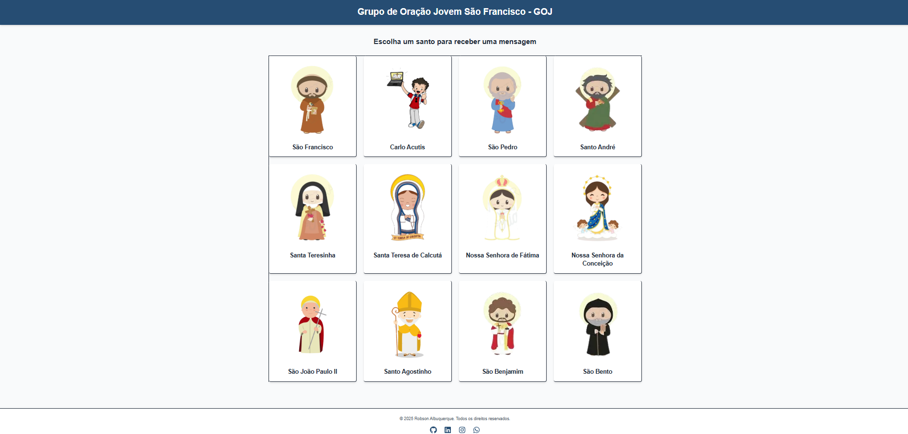

# 🙏 Galeria dos Santos

Uma galeria interativa criada com **Next.js + Tailwind CSS + Framer Motion**, dedicada ao **Grupo de Oração Jovem São Francisco - GOJ**.  
Nela, o usuário pode visualizar santos católicos, clicar em um deles e receber **mensagens inspiradoras aleatórias**, cada uma **exclusiva do santo escolhido**.

---

## ✨ Funcionalidades

- ✅ Galeria responsiva com layout em grade
- ✅ Imagens de santos com tamanhos padronizados
- ✅ Cada santo tem mensagens próprias e aleatórias
- ✅ Animações suaves com Framer Motion
- ✅ Interface moderna e UX otimizada para desktop e mobile
- ✅ Organização de componentes e dados estruturados

---

## 🖼️ Preview



---

## 🛠️ Tecnologias utilizadas

- [Next.js 14](https://nextjs.org/)
- [React](https://reactjs.org/)
- [Tailwind CSS](https://tailwindcss.com/)
- [Framer Motion](https://www.framer.com/motion/)
- [TypeScript](https://www.typescriptlang.org/)

---

## 🚀 Como executar o projeto

### 1. Clone o repositório
```bash
git clone https://github.com/robsonalbuquerquedev/galeria-dos-santos.git
cd galeria-dos-santos
```

### 2. Instale as dependências

```bash
npm install
```

### 3. Execute o projeto

```bash
npm run dev
```

Acesse: http://localhost:3000

---

## 🤝 Contribuição

Contribuições são bem-vindas!
Você pode:

- Criar novos cards de santos com imagens e mensagens

- Melhorar a responsividade ou acessibilidade
 
- Sugerir novas funcionalidades

## 📜 Licença

Este projeto está sob a licença MIT. Veja o arquivo [LICENSE](LICENSE) para mais detalhes.

## 🙌 Agradecimentos

Projeto desenvolvido por Robson Albuquerque, inspirado pelo desejo de unir fé, tecnologia e design de forma simples e inspiradora.
Deus te abençoe! ✝️
